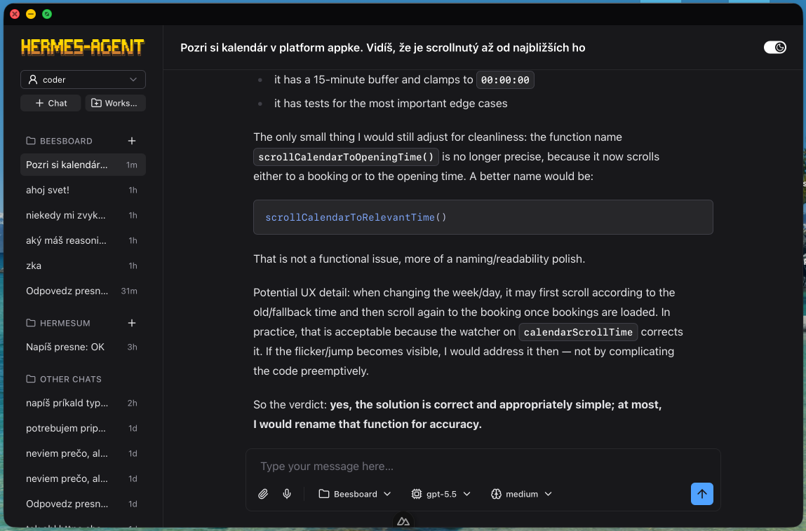
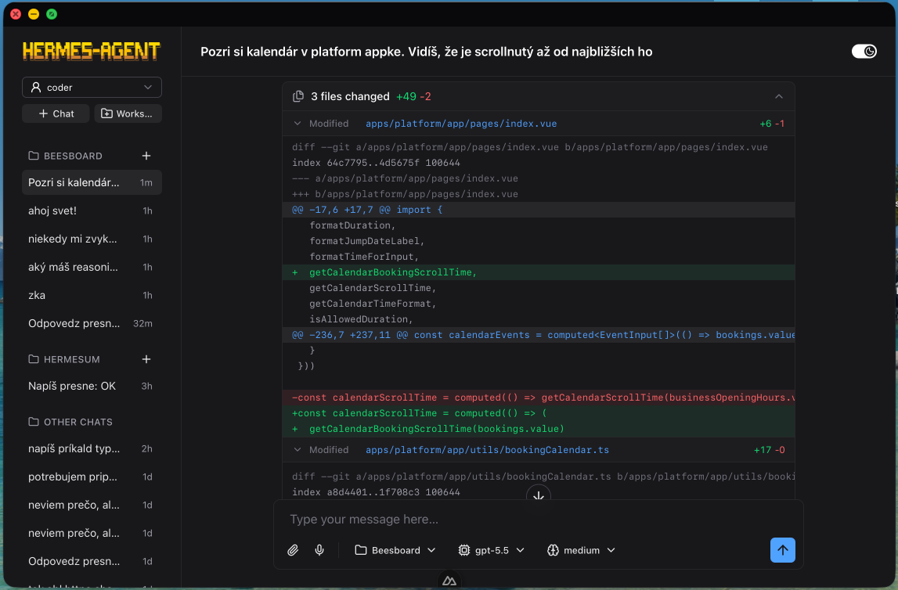

# Hermesum

Hermesum is a native web chat interface for Hermes Agent. It is built around the Agent Client Protocol (ACP): the browser talks to same-origin Nuxt/Nitro routes, Nitro owns a long-lived `hermes acp` subprocess, and the UI renders ACP sessions, prompts, streaming updates, tool activity, permissions, models, modes, and configuration options.

This repository is the source of truth for the Hermesum prototype. Hermes Agent remains the actual agent runtime; Hermesum is the product/UI layer on top of it.

## Preview

<p>
  
  
</p>

## Product Direction

Hermesum focuses on making Hermes Agent easier to operate from a browser:

- chat-first sessions with clear streaming, stop/cancel, queued follow-ups, and deterministic message ordering
- visible reasoning, tool calls, plans, permissions, duration, and usage metadata where ACP exposes them
- workspace-aware session organization without making the browser talk directly to agent stdio
- practical controls for model, mode, reasoning/config options, profiles, and project context

## Architecture

```text
Browser / Nuxt UI
  -> same-origin /api/acp/* routes
  -> Nitro ACP bridge using @agentclientprotocol/sdk
  -> long-lived `hermes --profile hermesum acp` subprocess
  -> Hermes Agent runtime

Browser / Nuxt UI
  -> same-origin /api/app/* routes
  -> Hermesum-owned app features that ACP does not own
```

Core boundaries:

- `web/app/**` is the Nuxt 4 frontend: pages, layout, components, composables, types, UI utilities, and assets.
- `web/server/acp/**` owns ACP protocol/runtime integration: subprocess lifecycle, session replay capture, event backlog, permissions, reasoning/usage supplements, and prompt correlation.
- `web/server/api/acp/**` exposes ACP-backed HTTP/SSE routes to the browser.
- `web/server/app/**` and `web/server/api/app/**` own Hermesum product concerns that are not ACP protocol state, such as workspaces, profile listing, and read-aloud speech generation.
- `web/shared/acp/**` contains browser/server-safe ACP event and transcript normalization helpers.

Browser code must not connect to ACP stdio directly. All browser runtime access goes through same-origin `/api/acp/*` or `/api/app/*` routes.

## What Exists Today

### ACP-native chat

- New-chat entry point at `/` that creates/opens an ACP session.
- Main chat route at `/acp/:sessionId`.
- ACP session list/load/create/fork/close.
- Prompt submission, cancellation, visible active prompt state, and queued follow-up messages.
- Session-scoped SSE event stream with bounded replay backlog.
- Server-side `session/load` replay capture so early replay events are not lost before the browser subscribes.
- Message reconciliation keyed by ACP/session identities instead of text or timestamp matching.
- Safe permission UI/server resolution through validated request and option ids.

### Session replay

Chats are built from ACP `session/load` replay plus live SSE events. Hermesum no longer keeps a local normalized transcript projection/cache; the source of truth is the Hermes ACP session data and the in-memory event stream for the open page.

### Workspace, profile, and app-owned features

- Workspace list/create/edit/delete/order and directory discovery through `/api/app/workspaces/*`.
- Sidebar grouping by workspace plus Hermesum-owned title/pin/archive metadata for ACP sessions.
- Profile listing through `/api/app/profiles`; switching profiles is shown as an app restart boundary rather than silently changing the running ACP subprocess.
- Read-aloud speech generation through `/api/app/read-aloud/speech`.
- Composer-local state such as drafts, attachments, queued messages, voice/read-aloud controls, slash-command autocomplete, and UI preferences.

### Inspection and UI

- Nuxt UI chat primitives for messages, prompt input, tool details, reasoning, and run details where practical.
- Comark markdown rendering for assistant and reasoning content.
- ACP plan rendering from `session/update` plan events.
- Model, mode, and config controls sourced from ACP session metadata. Hermesum filters unsupported/undesired reasoning choices from the UI, but the source of truth remains ACP metadata.

## Quick Start

### Dev mode

Use dev mode for normal UI work:

```bash
./run-local.sh --dev
```

Then open `http://127.0.0.1:3019/`.

This mode:

- starts the Nuxt dev server on `http://127.0.0.1:3019`
- serves same-origin Nitro routes for `/api/acp/*` and `/api/app/*`
- starts the ACP subprocess as `hermes --profile hermesum acp` by default
- reloads frontend changes through Vite HMR
- cleans up stale local server ports before startup

Useful overrides:

```bash
WEB_DEV_PORT=3020 ./run-local.sh --dev
WEB_DEV_HOST=0.0.0.0 ./run-local.sh --dev
HERMESUM_PROFILE=coder ./run-local.sh --dev
HERMESUM_ACP_ARGS="--profile coder acp" ./run-local.sh --dev
HERMESUM_ACP_CWD=/path/to/workspace ./run-local.sh --dev
```

### Direct frontend commands

For isolated frontend-only work:

```bash
cd web
pnpm install
pnpm dev
```

Direct `pnpm dev` still serves Nitro routes, but it uses the environment available to that shell. If ACP behavior looks wrong, check `/api/acp/health` and confirm the command, args, cwd, and profile are expected.

### Production-style preview

```bash
./run-local.sh
```

This builds `web/` and starts the Nitro server from `web/.output/server/index.mjs` on `http://127.0.0.1:9119` by default.

Override the port with:

```bash
PORT=9120 ./run-local.sh
```

For one-off API/browser smoke on a safe port:

```bash
cd web
pnpm build
PORT=4046 HOST=127.0.0.1 node .output/server/index.mjs
```

## Repository Structure

```text
web/                                        # Nuxt/Nitro app
  app/components/                           # chat, sidebar, workspace, prompt, and layout UI
  app/composables/                          # ACP/app API clients and local UI state
  app/layouts/default.vue                   # app shell, sidebar, profile/workspace controls
  app/pages/index.vue                       # new-chat entry point
  app/pages/acp/[id].vue                    # ACP-native chat route
  app/types/                                # ACP API and UI chat types
  app/utils/                                # ACP normalization re-exports, sidebar mapping, drafts, sounds, etc.
  shared/acp/                               # browser/server-safe ACP types and normalization helpers
  server/acp/                               # ACP bridge, event backlog, permissions, runtime helpers
  server/api/acp/                           # ACP protocol-backed Nitro routes
  server/api/app/                           # Hermesum-owned product routes
  server/app/                               # workspace/profile/session metadata helpers
  tests/                                    # node:test coverage for helpers and server/runtime utilities
run-local.sh                                # local Nuxt dev/preview orchestration
AGENTS.md                                   # coding-agent rules and architecture boundaries
.hermes/agent-map.md                        # first-read map for future agents
.runtime/                                   # disposable generated runtime/cache state
```

## Development Notes

- Treat `/Users/pavolbiely/Sites/hermesum` as the project root.
- Do not edit `$HOME/.hermes/hermes-agent` unless explicitly approved.
- Use `/api/acp/*` for ACP runtime behavior and `/api/app/*` for Hermesum product behavior.
- Do not recreate legacy `/api/web-chat/*` contracts.
- Keep shared request/response types aligned between Nitro handlers, composables, and frontend types.
- Prefer Nuxt UI and project-native components before creating custom UI primitives.
- Keep `.runtime/`, `.nuxt/`, `.output/`, `node_modules/`, logs, and generated artifacts out of source changes.
- Update `README.md`, `AGENTS.md`, `.hermes/agent-map.md`, and active `.hermes/plans/*.md` only when behavior, architecture, setup, workflow, or verification guidance changes.

## Debugging ACP Startup

If the app hangs on startup or browser console shows module/import errors after a failed load, first check ACP health:

```bash
curl http://127.0.0.1:3019/api/acp/health
```

Expected defaults include:

```json
{
  "command": "hermes",
  "args": ["--profile", "hermesum", "acp"],
  "cwd": "/Users/pavolbiely/Sites/hermesum"
}
```

Useful checks:

- `initialized: true` means the ACP client/server handshake completed.
- `stderr` contains diagnostics; stderr logs are not automatically health failures.
- Wrong profile, wrong cwd, or unrelated MCP startup retries usually mean the server was launched with the wrong environment or stale runtime config.
- Restart the dev server after changing `nuxt.config.ts` or ACP runtime env vars.

## Verification

GitHub Actions runs the web checks on every push and pull request via `.github/workflows/tests.yml`.

From `web/`:

```bash
node --test tests/*.test.mjs
pnpm typecheck
pnpm build
```

Targeted checks are preferred while iterating. Do not claim a check passed unless it was actually run.

API smoke against a production preview:

```bash
cd web
pnpm build
PORT=4046 HOST=127.0.0.1 node .output/server/index.mjs
curl http://127.0.0.1:4046/api/acp/health
curl -X POST http://127.0.0.1:4046/api/acp/initialize
curl http://127.0.0.1:4046/api/acp/sessions
curl http://127.0.0.1:4046/api/acp/sessions/<sessionId>
```

Browser smoke should confirm:

- the app renders beyond the startup loader
- the sidebar lists ACP/CLI sessions grouped by workspace
- opening a session shows replayed ACP messages
- sending a prompt streams visibly and can be cancelled safely
- tool, reasoning, plan, and permission states render safely
- model/mode/config controls render when exposed by ACP
- workspace selection affects new session cwd
- no `/api/web-chat/*` requests are made

## Safety Model

- Browser code never talks to ACP stdio directly.
- Permission requests must be visible, validated, resolved once, and denied/cancelled rather than silently allowed when unsupported.
- Prompt/session correctness should be keyed by explicit ACP ids: `sessionId`, `turnId`, ACP message ids, tool ids, request ids, and server event sequences.
- Avoid text equality, timestamps, “last assistant message”, or delayed snapshot patching as primary reconciliation mechanisms.
- Global package-manager changes, Homebrew changes, Hermes Agent updates, and edits to `$HOME/.hermes/hermes-agent` require explicit approval.

## Positioning

Hermesum is not a replacement for Hermes Agent internals. It is a focused ACP-native operator interface: browser-first, inspectable, workspace-aware, and designed to make real agent sessions easier to run and understand.
